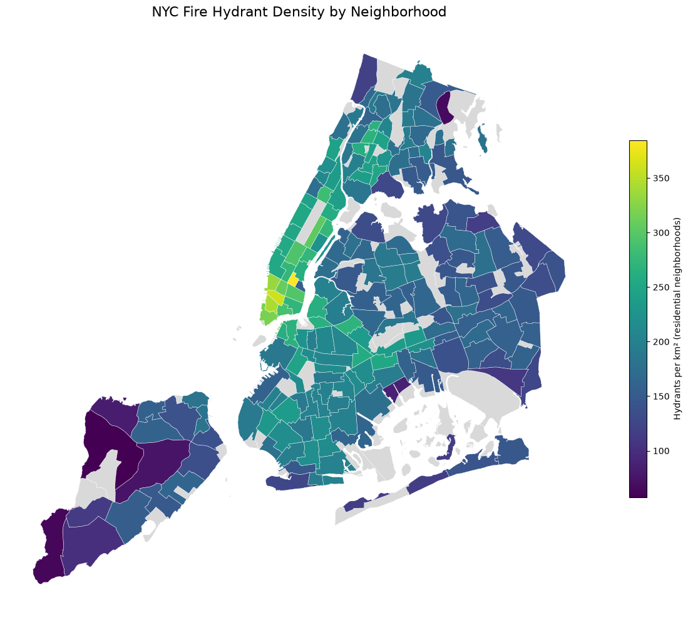

# NYC Hydrant Density Analysis

Portfolio Project 2 of the Modern GIS Accelerator course by Matt Forrest, built from the course's starter repo.

## The question

Where is hydrant coverage densest in NYC, and which neighborhoods are underserved relative to their area?

"Underserved" here means lowest measured hydrant density and coverage per unit of area. Both measures use total neighborhood area, so low values may reflect land use (open space, waterfront, industrial land) rather than a real gap in service. See Findings.

## The data

- **NYC Neighborhoods (NTAs).** 262 polygons, of which 197 are residential (`ntatype = '0'`). The rest are parks, cemeteries, airports, and water bodies. Source: [NYC Open Data](https://opendata.cityofnewyork.us).
- **NYC Fire Hydrants.** 109,725 points. Source: [NYC Open Data](https://opendata.cityofnewyork.us).
- License: NYC Open Data Terms of Use.
- All source data in EPSG:4326.

## Methodology

I built the same five-step analysis twice, once in SQL (PostGIS) and once in Python (GeoPandas), to see how each tool handles the same spatial operations and to cross-check the results.

| Step | SQL (PostGIS) | Python (GeoPandas) |
|---|---|---|
| 1. Filter | `WHERE boroname = 'Manhattan'` | boolean mask on the neighborhoods GeoDataFrame |
| 2. Spatial join | `JOIN ... ON ST_Contains(n.geom, h.geom)` | `gpd.sjoin(..., predicate="within")` |
| 3. Aggregate | `GROUP BY ntaname`, `COUNT(*)` | `groupby("ntaname").size()` |
| 4. Normalize | `ST_Area(ST_Transform(geom, 2263)) / 10763910.42` | `to_crs(2263).area / 10_763_910.42` |
| 5. Coverage | `ST_Union(ST_Buffer(geom::geography, 100)::geometry)` + `ST_Intersection` | `buffer(...).union_all()` + `intersection` |

- **SQL.** Five progressive queries in `analysis.sql`, from a simple filter to a spatial join to area-normalized density to a 100 m coverage analysis. The median coverage uses `percentile_cont(0.5) WITHIN GROUP (ORDER BY covered_pct)`.
- **Python.** The equivalent pipeline in `analysis.ipynb`, plus a static choropleth, an interactive map, and a GeoParquet export.

Decisions that affect the results:

- **Area is computed in a projected CRS.** Neighborhoods are reprojected to EPSG:2263 (NY State Plane Long Island, US survey feet) before measuring area, then converted to km². Computing area in EPSG:4326 would give square degrees.
- **Residential neighborhoods only.** Density and coverage statistics use the 197 residential NTAs (`ntatype = '0'`), so large parks, airports, and cemeteries don't dominate the bottom of the ranking.
- **The 100 m buffer needs care with units.** EPSG:2263 is in feet, so Python buffers by 328.084 ft (a buffer of `100` would be only 100 feet). SQL avoids the conversion by buffering on `geography`, where the unit is meters, then casting back to `geometry`. The two methods gave the same median coverage (see the cross-check below).

## Findings

All figures cover the 197 residential neighborhoods.

- **Top 5 by hydrant density (per km²):**
  1. Gramercy (384.7)
  2. SoHo-Little Italy-Hudson Square (360.0)
  3. Tribeca-Civic Center (343.3)
  4. West Village (333.7)
  5. Financial District-Battery Park City (319.1)
- **Bottom 5 by density:**
  1. New Springville-Willowbrook-Bulls Head-Travis (57.1)
  2. Tottenville-Charleston (63.3)
  3. Co-op City (67.1)
  4. Todt Hill-Emerson Hill-Lighthouse Hill-Manor Heights (74.1)
  5. Mariner's Harbor-Arlington-Graniteville (82.2)
- The median neighborhood has **185.8** hydrants per km².
- **Coverage:** in the median neighborhood, 97.6% of the area is within 100 m of a hydrant. The middle half of neighborhoods fall between 92.7% and 99.8%.
- **Lowest coverage** is concentrated in Staten Island (five of the ten lowest, led by New Springville at 48.5%). The four lowest on coverage are also among the five lowest on density.
- **Hypothesis (not tested):** because density and coverage are both measured against total neighborhood area, neighborhoods with a lot of open or non-residential land (parks, waterfront, industrial areas, large lots) would score lower without having fewer hydrants along their streets. The lowest-coverage list mixes low-density Staten Island neighborhoods with waterfront and industrial ones, which fits this explanation, but I did not measure land use to confirm it. Testing it would mean computing hydrant density against developed or street-network area instead of total area.




An interactive version is in [`images/density_map.html`](images/density_map.html). Download the file and open it in a browser, since GitHub shows HTML files as source code instead of rendering them.

## Cross-check: do the two pipelines agree?

Yes, on every result I compared:

| Result | SQL | Python |
|---|---|---|
| Top 5 density (Gramercy ... Financial District) | 384.7, 360.0, 343.3, 333.7, 319.1 | same |
| Bottom 5 density (New Springville ... Mariner's Harbor) | 57.11, 63.26, 67.06, 74.07, 82.24 | same |
| Median density (hydrants per km²) | 185.8 | 185.8 |
| Median coverage within 100 m | 97.61% | 97.6% |

I verified the top and bottom five and the two medians. The coverage medians agree even though the buffers were built differently (on `geography` in SQL, in projected feet in Python). I did not diff all 262 rows.

## How to run it

**Prerequisites:** Docker Desktop, a bash shell (I used Git Bash on Windows) with `curl`, GDAL installed so that `ogr2ogr --version` works, and a conda environment with Python 3.14 (developed on 3.14.7) for the Python pipeline.

```bash
git clone https://github.com/burlesongis/nyc-hydrant-analysis.git
cd nyc-hydrant-analysis
```

1. **Start PostGIS in Docker.** The database is the `kartoza/postgis` image, running in a container named `gis_postgis` (the name `load_data.sh` expects), mapped to host port 5435, with database `gis`, user `gis`, and password `gis`. These are throwaway credentials for a local container only. Save this as `docker/postgis/docker-compose.yml` and start it:

   ```yaml
   services:
     postgis:
       image: kartoza/postgis:latest
       container_name: gis_postgis
       ports:
         - "127.0.0.1:5435:5432"   # localhost only
       environment:
         POSTGRES_USER: gis
         POSTGRES_PASS: gis
         POSTGRES_DBNAME: gis
         ALLOW_IP_RANGE: 0.0.0.0/0
       volumes:
         - postgis_data:/var/lib/postgresql   # keeps data across restarts
   volumes:
     postgis_data:
   ```

   ```bash
   docker compose -f docker/postgis/docker-compose.yml up -d
   ```

   *Note: this compose file was reconstructed from the settings of the container I used for this project, and I have not tested it from a clean start. If you hit a problem, the essentials are the image, the port mapping, and the four environment variables.*

2. **Download and load the data.** `load_data.sh` does both steps:

   ```bash
   bash load_data.sh
   ```

   Run it from the repository root, since it writes to `./data/raw`. It downloads the two GeoJSON files from NYC Open Data (datasets `9nt8-h7nd` for neighborhoods and `5bgh-vtsn` for hydrants), checks that PostGIS is reachable, then loads them with `ogr2ogr` into the tables `nyc_neighborhoods` and `nyc_hydrants`. Each table gets a `geom` geometry column in EPSG:4326 and a `gid` primary key. The load uses `-overwrite`, so you can re-run it safely. When it finishes, it prints the row counts (262 neighborhoods, about 109,725 hydrants) and the geometry column types as a check.

   The download requests are capped at 300 neighborhoods and 120,000 hydrants, which leaves headroom over the current counts. Connection settings default to the local setup above and can be overridden with the `PGHOST`, `PGPORT`, `PGDATABASE`, `PGUSER`, and `PGPASSWORD` environment variables. The load also creates spatial indexes on both `geom` columns (`nyc_hydrants_geom_geom_idx` and `nyc_neighborhoods_geom_geom_idx`), which is the `ogr2ogr` PostgreSQL driver's default, so the `ST_Contains` join in `analysis.sql` doesn't need any extra indexing step. You can confirm with `\di` in psql.

3. **Run the SQL pipeline.**

   ```bash
   psql -h localhost -p 5435 -U gis -d gis -v ON_ERROR_STOP=1 -f analysis.sql
   ```

   The password is `gis`. If `psql` isn't installed on your machine, pipe the file into the container instead. In bash:

   ```bash
   docker exec -i -e PGPASSWORD=gis gis_postgis psql -h localhost -U gis -d gis -v ON_ERROR_STOP=1 < analysis.sql
   ```

   In PowerShell:

   ```powershell
   Get-Content analysis.sql | docker exec -i -e PGPASSWORD=gis gis_postgis psql -h localhost -U gis -d gis -v ON_ERROR_STOP=1
   ```

   Query 5 builds one union of all the hydrant buffers, so it may take a minute or two.

4. **Run the Python pipeline** in the conda environment (see the environment notes below):

   ```bash
   jupyter lab analysis.ipynb
   ```

### Environment notes

- The geospatial core (PROJ 9.8.1, pyproj 3.8.0, shapely 2.1.2) comes from conda-forge. GeoPandas 1.2.0 is what imports (conda's `geopandas-base`), though `conda list` also shows a leftover pip entry for `geopandas` 1.1.4, so the environment is still a small conda/pip mix. My first suspicion for the `NaN` problem was a pip/conda mismatch of PROJ-related packages, and reinstalling from conda-forge helped, but the remaining failures came from PROJ's network mode (next bullet).
- The notebook sets `PROJ_NETWORK=OFF` before importing GeoPandas. With PROJ's network mode on, reprojecting to EPSG:2263 returned infinite coordinates for 248 of 262 neighborhoods on my machine, which produced `NaN` areas and densities. Turning the network off forces PROJ to use local transformations, which are accurate to about a meter at this scale.
- The first notebook cell also clears `PROJ_LIB`. On my machine a system-wide `PROJ_LIB` left by PostgreSQL's PostGIS install pointed to a different PROJ data folder. I did not confirm that it affected the results, so treat this as a precaution.

## What I learned

- **The environment was harder than the spatial logic.** After reprojecting to EPSG:2263, 248 of 262 neighborhoods came back `NaN` because PROJ's network mode produced infinite coordinates. Setting `PROJ_NETWORK=OFF` fixed it. I only found the cause by checking raw coordinates, since `NaN` rows sort to the bottom and made the top 10 look plausible.
- **Two ways to measure area in SQL.** I compared a projected-area version of Query 4 against a `geography`-cast version. They agreed to within 0.01 hydrants per km² in the top 10, and I kept the projected one because it matches GeoPandas exactly.
- **Units matter.** EPSG:2263 is in feet, so a buffer of `100` is 100 feet, not 100 meters. I used 328.084 ft in Python and buffered on `geography` (meters) in SQL.
- **Check column names right after loading.** The starter code assumed `neighborhood` and `borough`, but the live NYC Open Data table uses `ntaname` and `boroname`, so queries and notebook cells failed until I printed the columns.
- **Next time,** I'd check units, CRS, and column names first, and count `NaN` values before sorting.

## How I used AI

I wrote the SQL queries myself and used Claude (Anthropic) as a reviewer and debugging partner, following the course's workflow. Claude reviewed my queries and suggested changes (for example, adding the residential filter to Query 5 and projecting the buffer union once), wrote the median queries (median density and Query 5b), helped diagnose the PROJ reprojection problem, helped style the maps, and drafted this README, which I edited and checked against my own results. The notebook builds on the course starter template.

## Stack

- PostgreSQL 18 + PostGIS (`kartoza/postgis` Docker image)
- GeoPandas, pyproj, shapely, matplotlib, folium
- Jupyter
- GeoParquet
